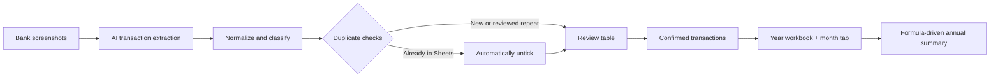
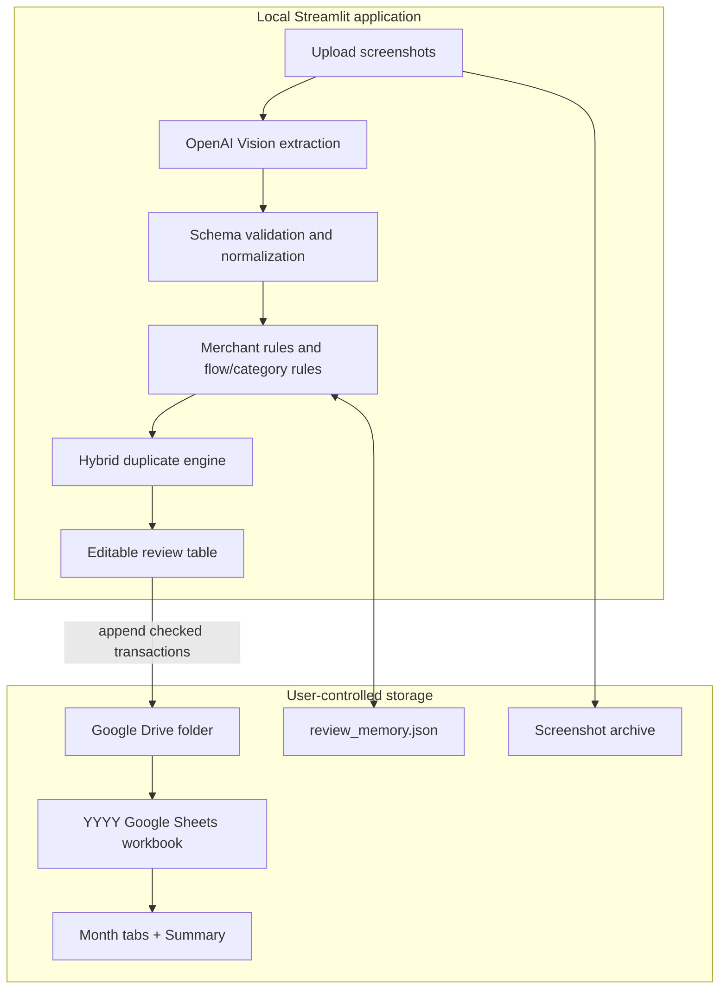
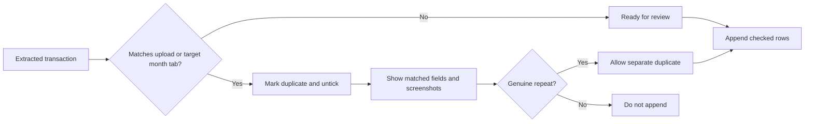
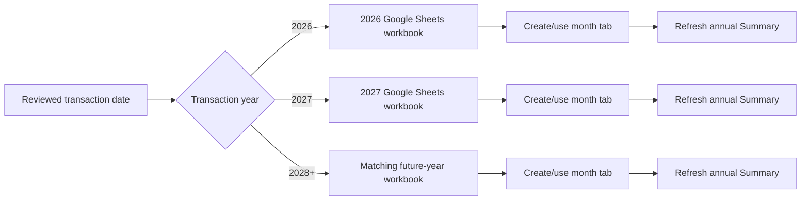

# ExpenditureAI

> **My personal project that I developed to leverage on AI expense operations layer for bank screenshots.**
>
> Turn DBS Bank, DBS PayLah, and UOB TMRW screenshots into a clean Google Sheets ledger, without rekeying transactions or accidentally double-counting them.

| Product | Workflow | Destination |
| --- | --- | --- |
| **AI receipt inbox** | Upload -> extract -> review -> confirm | **Google Sheets annual ledger** |
| Built with Streamlit and OpenAI Vision | Duplicate-aware and human-controlled | Monthly tabs plus an annual summary |

## The Product



### Built for the moment after you pay

| | What ExpenditureAI does | Why it matters |
| --- | --- | --- |
| **1. Capture** | Reads one or many bank screenshots with structured AI extraction. | Eliminates manual transaction entry. |
| **2. Control** | Detects overlaps, known transactions, incorrect signs, and category conflicts before append. | Keeps the ledger trustworthy. |
| **3. Organize** | Routes each record into the right year workbook and month tab automatically. | Keeps every year self-contained. |
| **4. Understand** | Maintains a monthly category matrix, subtotals, offsets, and year totals. | Makes spending patterns immediately legible. |

## MVP Capabilities

| AI extraction | Financial controls | Sheets automation |
| --- | --- | --- |
| Typed transactions from UOB TMRW, DBS Bank, and DBS PayLah screenshots | Inflow/outflow sign rules and category validation | Creates a workbook for each year automatically |
| Concurrent screenshot processing with bounded workers | Side-by-side duplicate comparison before deciding a genuine repeat | Creates a month tab and summary column when a new month appears |
| Category suggestions, anomaly flags, and a short spending insight in one enrichment request | Existing Google Sheets matches are automatically unticked | Keeps the annual summary formula-driven and current |
| Merchant-rule learning with an inspect, edit, and forget screen | Ignores internal PayLah top-ups and UOB credit-card settlement transfers | Writes a clean user-facing ledger in columns A-L |

## System Design



### Decision model



Duplicate checks combine transaction hashes, keys, exact references, date, source, amount, currency, money flow, and conservative merchant-description similarity. A transaction already recorded in the matching Google Sheets month tab is automatically unchecked in the review table, so it cannot be appended again unless you deliberately reselect it.

## Annual Workbook Routing



Transactions never get compiled into the wrong year. Uploading a 2027 transaction creates or uses a `2027` Google Sheets workbook instead of adding it to `2026`; the same routing applies to 2028 and every later year. A newly seen month creates a month tab and a new month column in that year's Summary.

## Categories And Money Flow

| Outflows | Inflows / offsets |
| --- | --- |
| `Food`, `Public Transport`, `Taxi`, `Shopping`, `Gifts`, `Entertainment`, `Travel`, `Health`, `Personal Care`, `Education`, `Bills`, `Admin & Fees`, `Others`, `Insurance`, `Subscriptions`, `Income Tax` | `Carousell Sales`, `Cashbacks & Refunds`, `Reimbursement`, `GVs & Prize Award` |

Outflows must be negative and inflows must be positive. Inflow categories are shown in the Summary as offsets: they reduce `Net Spend` and roll into `Total Offset (c)`. `Transfer` is reserved for neutral internal transfers, including ignored PayLah top-ups.

## Google Sheets Experience

### Monthly ledger

Each month tab keeps the user-facing ledger in columns A-L. The header is frozen, category and check fields have dropdowns, column D is widened for categories, and column E is widened for merchant descriptions.

| A | B | C | D | E | F | G | H | I | J | K | L |
| --- | --- | --- | --- | --- | --- | --- | --- | --- | --- | --- | --- |
| `check` | `date` | `source` | `category` | `description` | `amount_original` | `amount_parse_error` | `amount` | `currency` | `transaction_reference` | `money_flow` | `transaction_type` |

### Annual Summary

The Summary is one readable matrix: categories as rows, calendar-ordered `Month Year` columns, and a `Year Total` column. Only monthly rows with `check = Yes` are included.

```text
Net Spend (a + b + c)          highlighted closing figure
  Variable categories
Variable Spend (a)             variable-spend subtotal
  Insurance / Subscriptions / Income Tax
Fixed Spend (b)                fixed-spend subtotal
Gross Spend (a + b)            spend before offsets
  Carousell Sales / Cashbacks & Refunds / Reimbursement / GVs & Prize Award
Total Offset (c)               inflow total
Net Spend (a + b + c)          repeated closing figure
```

Variable spend, fixed spend, gross spend, offsets, and net spend are visually differentiated so a user can scan the calculation rather than audit formulas.

## How To Use It

1. Upload one or more transaction screenshots in the Streamlit app.
2. Let the app extract, normalize, classify, and compare transactions.
3. Review the table. Correct category, money flow, amount, or duplicate decisions where needed.
4. Confirm the checked rows to append them to the matching `YYYY` workbook and month tab.
5. Open the refreshed `Summary` tab for the annual view.

### Review states

| State | Meaning | Default action |
| --- | --- | --- |
| `ready` | New transaction that can be appended | Checked |
| `needs_review` | A field needs human confirmation | Review before append |
| `duplicate` | Likely already recorded or repeated | Unchecked |
| `ignored` | Intentional non-expense movement | Unchecked |

The `Dates to append` selector defaults to every extracted valid date. Remove a date to skip it for the current append only. Use `separate duplicate?` only after confirming a duplicate is a real, separate transaction.

## Setup

### 1. Install

```powershell
python -m venv .venv
.\.venv\Scripts\Activate.ps1
pip install -r requirements.txt
Copy-Item .env.example .env
```

### 2. Configure `.env`

```text
OPENAI_API_KEY=...
GOOGLE_DRIVE_FOLDER_ID=...
GOOGLE_SERVICE_ACCOUNT_FILE=service_account.json
VISION_CONCURRENCY=3
```

| Optional setting | Purpose |
| --- | --- |
| `OPENAI_MODEL` | Model used for the enrichment request. |
| `GOOGLE_SHEET_ID` | Use one fixed spreadsheet instead of year/month routing. |
| `GOOGLE_WORKSHEET_NAME` | Worksheet name for fixed-spreadsheet mode. |
| `SCREENSHOT_ARCHIVE_DIR` | Archive folder; defaults to `screenshots`. |
| `REVIEW_MEMORY_FILE` | Merchant-rule store; defaults to `review_memory.json`. |

### 3. Connect Google Drive

1. Create a Google Cloud service account.
2. Enable the Google Sheets API and Google Drive API.
3. Download its JSON key as `service_account.json`.
4. Share the target Google Drive folder with the service-account email as an Editor.
5. Add the folder ID to `GOOGLE_DRIVE_FOLDER_ID`.

Detailed instructions: [GOOGLE_SETUP.md](GOOGLE_SETUP.md).

```text
Expenditure folder
  2026 Google Sheet
    May tab
    June tab
    Summary tab
  2027 Google Sheet
    January tab
    Summary tab
```

## Run

```powershell
.\.venv\Scripts\Activate.ps1
streamlit run app.py
```

On Windows, `launch.bat` starts the app as well.

## AI And Data Principles

| Principle | Implementation |
| --- | --- |
| Structured AI, not free-form text | Pydantic schemas validate extraction and enrichment responses. |
| Fast enough for batches | Bounded concurrent Vision requests process several screenshots at once. |
| One place for judgment | Category suggestions, anomaly flags, and spending insight share one enrichment request. |
| Human stays in control | No transaction is appended until it remains checked in the editable review table. |
| Private by default | The app runs locally; sensitive credentials and records are excluded from Git. |

## Tests

```powershell
.\.venv\Scripts\python.exe -m unittest discover -s tests -v
```

The regression suite covers Google Sheets output, summary formulas and layout, category migrations, reimbursement and offset rules, duplicate detection, merchant rules, year/month routing, and performance behaviour.

## Privacy And Security

- Screenshots are sent to OpenAI only for the requested extraction.
- Confirmed transactions are sent to Google Sheets only when you append them.
- `.env`, `service_account.json`, screenshots, virtual environments, and `review_memory.json` are ignored by Git.
- Never commit service-account keys or real OpenAI API keys.
