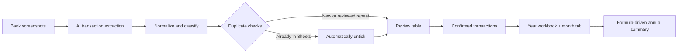
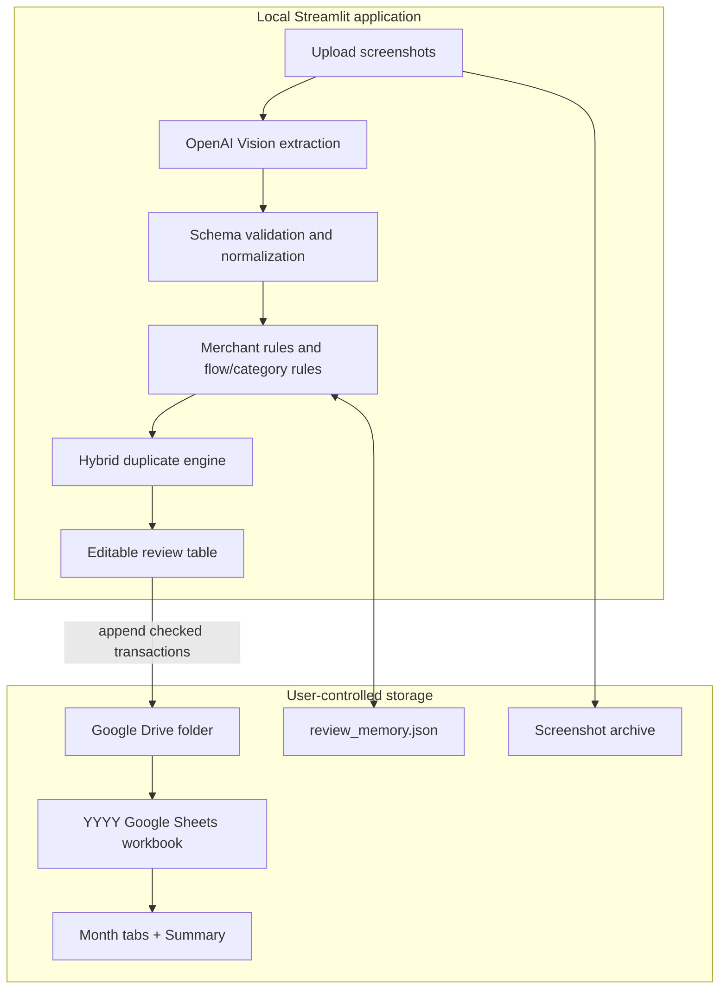
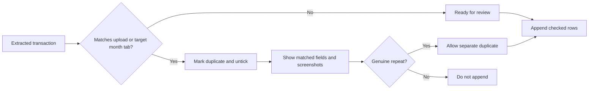
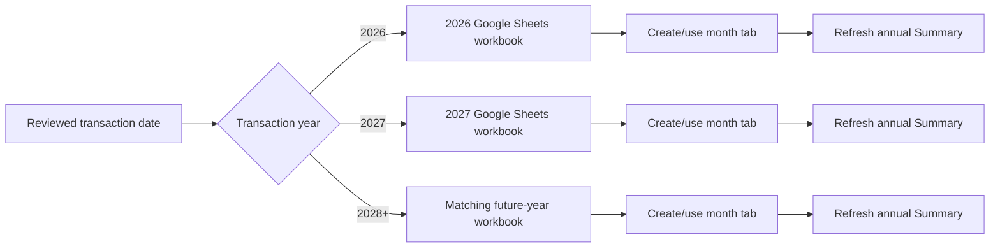

# ExpenditureAI

> **My personal project that I developed to leverage on AI expense operations layer for bank screenshots.**
>
> Turn DBS Bank, DBS PayLah, and UOB TMRW screenshots into a clean Google Sheets ledger, without rekeying transactions or accidentally double-counting them.

| Product | Workflow | Destination |
| --- | --- | --- |
| **AI receipt inbox** | Upload -> extract -> review -> confirm | **Google Sheets annual ledger** |
| Built with Streamlit and OpenAI Vision | Duplicate-aware and human-controlled | Monthly tabs plus an annual summary |

## The Product



### Built for the moment after you pay

| | What ExpenditureAI does | Why it matters |
| --- | --- | --- |
| **1. Capture** | Reads one or many bank screenshots with structured AI extraction. | Eliminates manual transaction entry. |
| **2. Control** | Detects overlaps, known transactions, incorrect signs, and category conflicts before append. | Keeps the ledger trustworthy. |
| **3. Organize** | Routes each record into the right year workbook and month tab automatically. | Keeps every year self-contained. |
| **4. Understand** | Separates income, expenditure, offsets, and investment/savings allocations. | Shows both operating surplus and cash left after allocations. |

## MVP Capabilities

| AI extraction | Financial controls | Sheets automation |
| --- | --- | --- |
| Typed transactions from UOB TMRW, DBS Bank, and DBS PayLah screenshots | Inflow/outflow sign rules and category validation | Creates a workbook for each year automatically |
| Concurrent screenshot processing with bounded workers | Side-by-side duplicate comparison before deciding a genuine repeat | Creates a month tab and summary column when a new month appears |
| Category suggestions, anomaly flags, and a short spending insight in one enrichment request | Existing Google Sheets matches are automatically unticked | Keeps the annual summary formula-driven and current |
| Merchant-rule learning with an inspect, edit, and forget screen | Ignores internal PayLah top-ups and UOB credit-card settlement transfers | Writes a clean user-facing ledger in columns A-L |

## System Design



### Decision model



Duplicate checks combine transaction hashes, keys, exact references, date, source, amount, currency, money flow, and conservative merchant-description similarity. A transaction already recorded in the matching Google Sheets month tab is automatically unchecked in the review table, so it cannot be appended again unless you deliberately reselect it.

## Annual Workbook Routing



Transactions never get compiled into the wrong year. Uploading a 2027 transaction creates or uses a `2027` Google Sheets workbook instead of adding it to `2026`; the same routing applies to 2028 and every later year. A newly seen month creates a month tab and a new month column in that year's Summary.

## Categories And Money Flow

| Statement section | Categories |
| --- | --- |
| **Income (A)** | `Net Salary`, `Bonus / AVC / Other Employment Income`, `Carousell Sales`, `Prize Awards/Government Vouchers`, `Gifts received` |
| **Variable expenditure (B)** | `Food`, `Public Transport`, `Taxi`, `Shopping`, `Gifts`, `Entertainment`, `Travel`, `Health`, `Personal Care`, `Education`, `Admin & Fees`, `Others` |
| **Fixed expenditure (C)** | `Parent Allowance`, `Insurance`, `Subscriptions`, `Income Tax`, `Bills / Recurring Commitments` |
| **Expense offsets (D)** | `Reimbursements`, `Cashbacks & Refunds` |
| **Investment & savings allocation (E)** | `ETF Contributions`, `Equity Contributions`, `Crypto Contributions`, `Commodities Contributions`, `Dedicated Cash Savings`, `Other Investment Contributions` |

The ledger uses negative outflows and positive inflows. The cash statement displays positive magnitudes and subtracts offsets and allocations explicitly. Carousell sales are income, not expense offsets. `Transfer` covers neutral own-account movements, including ignored PayLah top-ups and card settlements. Government vouchers recorded in `Prize Awards/Government Vouchers` are treated as income; other noncash vouchers and funding movements are not.

## Google Sheets Experience

### Monthly ledger

Each month tab keeps the user-facing ledger in columns A-L. The header is frozen, category and check fields have dropdowns, column D is widened for categories, and column E is widened for merchant descriptions.

| A | B | C | D | E | F | G | H | I | J | K | L |
| --- | --- | --- | --- | --- | --- | --- | --- | --- | --- | --- | --- |
| `check` | `date` | `source` | `category` | `description` | `amount_original` | `amount_parse_error` | `amount` | `currency` | `transaction_reference` | `money_flow` | `transaction_type` |

### Annual Summary

The Summary is one cash-based statement: categories as rows, calendar-ordered `Month Year` columns, and a `Year Total` column. It includes checked (`Yes`) SGD transactions paid in the tab's month and workbook year, not forecasts, portfolio valuations, or accrued income.

```text
Total Income (A)
Total Variable Expenditure (B)
Total Fixed Expenditure (C)
Gross Expenditure                         B + C
Total Expense Offsets (D)
Net Expenditure                           B + C - D
Operating Surplus / (Deficit)              A - B - C + D
Total Investment & Savings Allocation (E)
Net Surplus / (Deficit) After Allocations  A - B - C + D - E
```

The familiar navy, teal, light-blue, light-grey, green, and pale-yellow sheet palette separates each section. SGD amounts and red parenthesized deficits make the calculation easy to scan. Allocations never reduce gross expenditure or operating surplus; they reduce only the final result.

**Example:** S$5,000 salary, S$1,000 Food, S$500 Parent Allowance, S$100 Reimbursements, and S$2,000 confirmed ETF contributions give **S$1,400 net expenditure**, **S$3,600 operating surplus**, and **S$1,600 after allocations**.

### Review inputs and missing values

| Input | Meaning |
| --- | --- |
| No recorded salary | The month displays `S$0.00`; an actually credited salary takes priority as soon as it is recorded. |
| App -> `allocation_confirmed` checkbox | Confirm a fresh contribution once. This writes `transaction_type = contribution`; pending allocations are excluded from append and preview totals. Buying with money already in a portfolio is not another fresh contribution. |

A recorded numeric zero is different from a missing amount. Invalid checked inputs leave the affected category and dependent subtotals blank; year totals also stay blank if any included month is missing. No salary estimate or currency conversion is assumed. A checked legacy allocation without contribution confirmation leaves allocation and final totals blank, but does not change operating surplus.

### Migration caveats

- Snapshot the workbook before the first redesign refresh. Summary now extends through row 45; a refresh stops if expanding the generated table would overwrite personal notes. Move those notes outside the new table before retrying.
- Monthly refresh preserves ledger amounts, blanks, formulas, and categories. Legacy negative offsets are interpreted as positive received amounts without rewriting the ledger.
- `Bills` is read as `Bills / Recurring Commitments`; `Reimbursement` is read as `Reimbursements`. Ambiguous `Family`, `Investments`, `Income`, `Funding`, and `GVs & Prize Award` entries require review, not automatic reclassification.
- Do not count own-account transfers, investment sale/redemption proceeds, CPF balances, or noncash vouchers as salary. Reconcile duplicate month tabs before refreshing; another year's dated entries are excluded.

## How To Use It

1. Drop one or more transaction screenshots into the Upload Inbox; processing starts automatically.
2. Resolve the `Needs Attention` items using their screenshot, recorded-sheet match, and recommendation evidence.
3. Inspect the collapsed `Ready` and `Excluded` groups and confirm fresh investment allocations where required.
4. Review the financial effect and use the single append action to write the selected rows.
5. Open the affected month tabs or annual Summary from the completion links.

### Guided inbox architecture

Each upload is retained as a batch outside the repository in the operating system's application-data directory. A batch stores screenshot processing states, transaction provenance, recommendations, user decisions, and append audits. The interface keeps routine rows compact and opens only uncertain, duplicate, invalid, or unusual rows for attention.

An optional external recommendation service can be configured with `EXPENDITURE_AI_RECOMMENDATION_URL`. It receives normalized transaction data, screenshot provenance, merchant memory, and possible matches, then returns a structured category, flow, confidence, duplicate assessment, evidence, and review reasons. It cannot write to Google Sheets. Timeouts or malformed responses fall back to the deterministic rules, and successful responses are cached by screenshot, transaction, model, endpoint, and schema version.

Google Sheets remains the transaction source of truth. Flow/category compatibility, signs, ignored bank transfers, allocation confirmation, duplicate blocking, year/month routing, and final append verification remain deterministic.

### Review states

| State | Meaning | Default action |
| --- | --- | --- |
| `ready` | New transaction that can be appended | Checked |
| `needs_review` | A field needs human confirmation | Review before append |
| `duplicate` | Likely already recorded or repeated | Unchecked |
| `ignored` | Intentional non-expense movement | Unchecked |

The `Dates to append` selector defaults to every extracted valid date. Remove a date to skip it for the current append only. Use `separate duplicate?` only after confirming a duplicate is a real, separate transaction.

## Setup

### 1. Install

```powershell
python -m venv .venv
.\.venv\Scripts\Activate.ps1
pip install -r requirements.txt
Copy-Item .env.example .env
```

### 2. Configure `.env`

```text
OPENAI_API_KEY=...
GOOGLE_DRIVE_FOLDER_ID=...
GOOGLE_SERVICE_ACCOUNT_FILE=service_account.json
VISION_CONCURRENCY=3
```

| Optional setting | Purpose |
| --- | --- |
| `OPENAI_MODEL` | Model used for the enrichment request. |
| `GOOGLE_SHEET_ID` | Use one fixed spreadsheet instead of year/month routing. |
| `GOOGLE_WORKSHEET_NAME` | Worksheet name for fixed-spreadsheet mode. |
| `SCREENSHOT_ARCHIVE_DIR` | Archive folder; defaults to `screenshots`. |
| `REVIEW_MEMORY_FILE` | Merchant-rule store; defaults to `review_memory.json`. |
| `EXPENDITURE_AI_DATA_DIR` | Optional persistent guided-inbox directory; defaults to the operating-system app-data location. |
| `EXPENDITURE_AI_RECOMMENDATION_URL` | Optional recommendation-only service endpoint. |
| `EXPENDITURE_AI_RECOMMENDATION_API_KEY` | Optional bearer token for the recommendation service. |
| `EXPENDITURE_AI_RECOMMENDATION_TIMEOUT_SECONDS` | External recommendation timeout; defaults to 5 seconds. |

### 3. Connect Google Drive

1. Create a Google Cloud service account.
2. Enable the Google Sheets API and Google Drive API.
3. Download its JSON key as `service_account.json`.
4. Share the target Google Drive folder with the service-account email as an Editor.
5. Add the folder ID to `GOOGLE_DRIVE_FOLDER_ID`.

Detailed instructions: [GOOGLE_SETUP.md](GOOGLE_SETUP.md).

```text
Expenditure folder
  2026 Google Sheet
    May tab
    June tab
    Summary tab
  2027 Google Sheet
    January tab
    Summary tab
```

## Run

```powershell
.\.venv\Scripts\Activate.ps1
streamlit run app.py
```

On Windows, `launch.bat` starts the app as well.

## AI And Data Principles

| Principle | Implementation |
| --- | --- |
| Structured AI, not free-form text | Pydantic schemas validate extraction and enrichment responses. |
| Fast enough for batches | Bounded concurrent Vision requests process several screenshots at once. |
| One place for judgment | Category suggestions, anomaly flags, and spending insight share one enrichment request. |
| Human stays in control | No transaction is appended until it remains checked in the editable review table. |
| Private by default | The app runs locally; sensitive credentials and records are excluded from Git. |

## Tests

```powershell
.\.venv\Scripts\python.exe -m unittest discover -s tests -v
```

The offline regression suite covers Decimal reconciliation, exact statement formulas/layout, missing-value propagation, salary review persistence, allocation confirmation, non-mutating monthly refreshes, category migrations, PayLah/UOB exclusions, duplicate detection, merchant rules, year/month routing, and performance behaviour. Sheets calls use fakes; these tests do not evaluate formulas in a live workbook.

Quiet run (including suppressed application logging):

```powershell
.\.venv\Scripts\python.exe -c "import logging,unittest; logging.disable(logging.CRITICAL); r=unittest.TextTestRunner(verbosity=0).run(unittest.defaultTestLoader.discover('tests')); raise SystemExit(not r.wasSuccessful())"
```

## Privacy And Security

- Screenshots are sent to OpenAI only for the requested extraction.
- Confirmed transactions are sent to Google Sheets only when you append them.
- `.env`, `service_account.json`, screenshots, virtual environments, and `review_memory.json` are ignored by Git.
- Never commit service-account keys or real OpenAI API keys.
